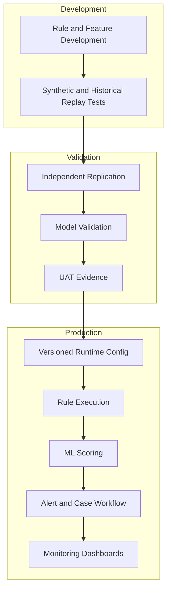

# Architecture And Component Design

This demo uses synthetic data to illustrate a production-shaped AML decisioning architecture. It is technology-neutral by design and avoids client, employer, vendor, or institution-specific confidential information.

## Logical Architecture

```mermaid
flowchart LR
    A[Source Systems] --> B[Batch and Event Ingestion]
    B --> C[Canonical AML Data Model]
    C --> D[Entity Resolution]
    D --> E[Point-in-Time Feature Layer]
    E --> F[Activation and Behavioral CRR]
    E --> G[Deterministic TM Rule Engine]
    F --> G
    G --> H[Raw Rule Results]
    H --> I[Suppression Policy Layer]
    I --> J[Alert Generation and Consolidation]
    J --> K[ML Alert Risk Rating]
    F --> K
    E --> K
    K --> L[Decision Orchestration]
    L --> M[Case Management]
    M --> N[Investigator Dispositions and QA]
    N --> O[Governed Feedback Store]
    O --> E
    O --> P[Validation and Monitoring]
    P --> Q[Governance Repository]
```

## Service Boundaries

| Service | Responsibility | Required Control |
|---|---|---|
| Ingestion | Load source events, reference data, outcomes, and external risk indicators | Source reconciliation, duplicate detection, late-arriving data handling |
| Canonicalization | Standardize customer, account, transaction, counterparty, device, geography, and case entities | Critical data element checks and lineage |
| Feature layer | Produce reusable point-in-time features for CRR, TM, and ML ARR | Feature versioning and leakage controls |
| CRR service | Calculate activation and behavioral risk scores with reason codes | Methodology approval and override logging |
| Rule engine | Evaluate deterministic scenarios with explicit eligibility, trigger, and evidence fields | Rule versioning, effective dating, independent replication |
| Suppression service | Apply approved suppressions after raw trigger retention | Suppression policy ID, approval reference, below-line sampling |
| Alert service | Create, deduplicate, consolidate, and route alert candidates | Idempotent alert IDs and lineage preservation |
| ML ARR service | Rank alerts or alert-customer records | Model version, feature availability, explainability, fallback |
| Case integration | Create or update cases and investigator queues | SLA tracking and evidence display |
| Feedback service | Capture dispositions, QA, SAR referrals, and confirmed outcomes | Label governance and maturation windows |
| Monitoring | Track data, rules, CRR, ML, and operations metrics | Thresholds, escalation, and issue management |

## Deployment Architecture

## Point-In-Time Reproducibility

Every generated rule result and alert carries rule, feature, model, observation-window, and evidence identifiers. A production implementation should additionally retain data snapshots, configuration checksums, deployment manifests, and lineage to source event IDs.

## Component Classification

| Component | Regulatory Or Risk Requirement | Required Design Element | Suggested Enhancement | Optional Future Capability | Assumption Requiring Validation |
|---|---|---|---|---|---|
| CRR | Risk-based CDD and monitoring intensity | Activation and behavioral scores with reason codes | Event-driven reassessment | Graph-enhanced CRR | Actual CDD/EDD policy and risk appetite |
| TM rule engine | Suspicious activity monitoring | Deterministic rules with eligibility, trigger, suppression, and evidence | Configurable rule DSL | Streaming execution | Product, rail, and jurisdiction scope |
| ML ARR | Risk-based alert prioritization | Human-reviewed ranking model | Champion/challenger scoring | Parallel ML detection | Approved ML use in compliance workflow |
| Alert workflow | Investigation and recordkeeping | Consolidated alerts with preserved child rule evidence | Network evidence panels | Dynamic playbooks | Case platform capabilities |
| Governance repository | Audit and examination readiness | Rule/model inventory, approvals, validation evidence | Automated evidence pack generation | Continuous controls monitoring | Governance toolchain |
